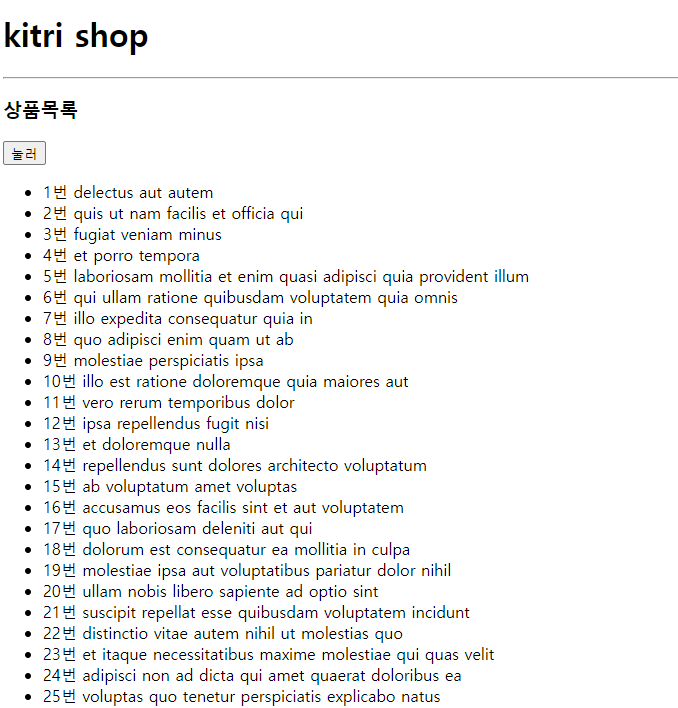

# 2일차

### 1. 배열(immutable 연습)
    ES-KITRI/functionDemo2.js
### 2. 펼침연산자/구조분해
- `Spread operator` 펼침연산자
    <br>배열이나 객체를 쉽게 복사하여 합칠수 있게 해줌.
    + 종류
        <br>배열 펼침 / 객체 펼침
        ```js
        const arr = [1,2,3];
        console.log([...arr,4,5,6]); //[1,2,3,4,5,6]

        const obj = {a: 1,b: 2};
        console.log({...obj,c :7}); //{a:1,b:2,c:7}
        ```
        <br>배열 복사 / 객체 복사
        ```js
        const arr = [1,2,3];
        const arrCopy = [...arr];
        
        const obj = {a: 1,b: 2};
        const objCopy = {...obj}; 
        ```
        <br>배열에서의 함수 파라미터
        ```js
        const nums = [1,2,3];
        console.log(Math.max(...nums)); // 3
        ```
        <br>객체 속성 오버라이드
        ```js
        const obj1 = {a:1,b:2,c:3};
        const obj2 = {...obj1,b:6}; //{a:1,b:6,c:3}
        ```
        <br>배열을 문자열로 펼치기
        ```js
        const str = 'hello';
        const chars = [...str]; //['h','e','l','l','o']
        ```
- `Destructuring` 구조분해
    + `Destructuring Assignment` 구조 분해 할당
    <br> 배열이나 객체의 속성을 해체하여 그 값을 개별 변수에 할당
    <br> 클린 코드가 되며, 변수 할당을 간결하게 함.
    + 종류
        <br>배열 구조분해
        ```js
        const arr = [1,2,3,4,5];
        const [a,b,c,...rest] = arr;
        console.log(a,b,c); // 1 2 3
        console.log(rest); //[4,5]
        ```
        <br>객체 구조분해
        ```js
        const obj = {a:1,b:2,c:3};
        const {a,b,c} = obj;
        console.log(a,b,c); // 1 2 3
        const {a : newA,b: newB,c: newC} = obj;
        console.log(newA,newB,newC); // 1 2 3
        ```
        <br>함수 파라미터에서의 구조분해
        ```js
        const obj = {a:1,b:2,c:3};
        function print({a,b,c}) {
            console.log(a,b,c);
        }
        print(obj);
        ```
### 3. 클래스/프로토타입
- `Class` 클래스
    <br>객체지향 프로그래밍(OOP)에 있어 중요한 개념
    <br>프로토타입 기반 프로그래밍으로 쉽고 직관적으로 접근 가능
    + 특징
        <br>클래스 선언
        ```js
        class MyClass{
        }
        ```
        <br>생성자
        ```js
        class MyClass{
            constructor(para1,para2){
                this.para1 = para1;
                this.para2 = para2;
            }
        }
        ```
        <br>메소드
        ```js
        class MyClass{
            myMethod(){
                console.log('hello world');
            }
        }
        ```
        <br>인스턴스 생성
        ```js
        let classA = new MyClass(1,3);
        console.log(classA); // MyClass {para1: 1, para2: 3}
        classA.myMethod(); //hello world
        ```
        <br>상속
        ```js
        
        ```
- `Prototype` 프로토타입
    
### 4. 브라우저 내장객체 
- HTML API
    + HTML Geolocation
    + HTML Web Storage
    + HTML Web Worker 

### 5. HTML DOM WITH JAVASCRIPT
<br>ES-KITRI/index.html
```html
<!DOCTYPE html>
<html lang="en">

<head>
    <meta charset="UTF-8">
    <meta name="viewport" content="width=device-width, initial-scale=1.0">
    <title>Document</title>
</head>

<body>
    <h1>kitri shop</h1>
    <hr>
    <h3 id="products"> 상품목록</h3>
    <button>눌러</button>
    <ul>
        <li>아이폰</li>
        <li>캘럭시폰</li>
        <li>아이패드</li>
    </ul>
    <h3>copyright 2023 by kitri</h3>
    <script src="domHandleing.js"></script>
</body>

</html>
```
<br>ES-KITRI/domHandleing.js
```js
// 버튼을 선택 (조회)한다,
// 버튼에 이벤트를 등록한다.
const button = document.getElementsByTagName('button')[0];
button.addEventListener('click', function () {
    console.log('cliek');
    const theTag = document.getElementById('products');
    theTag.innerText = 'product list';
});
//특정태그 선택
// const theTag = document.getElementById('products');
// console.log(theTag);
// theTag.innerText = 'product list';
```

- DOM 다루기
    + CSS 셀렉터 이용
    + DOM 노드(html tag) 찾고 만들고 붙이기
- EVENT 처리
    + `addEventListener('event',콜백함수)`
- CSS 스타일
    + `.classList.add('클래스 명')`
    + `add()` 대신에 `remove()`, `toggle()`,`contains()` 메소드 제공
### 6. API와 비동기 프로그래밍 
- API(Application Programming Interface)
    + 고유한 기능을 가진 두 애플리케이션 간의 서비스 계약
    + 요청과 응답으로 이루어진 애플리케이션 통신 방법 정의
    + API 문서에 관련 정보 포함
- API 작동방식
    + SOAP API
    + RPC API
    + Websocket API
    + REST API
- REST API
    
    ```js
    //백엔드에서 데이터를 가져온다.
    //API server의 url
    //https://jsonplaceholder.typicode.com/todos
    //XMLHttpRequest - ajax
    let todos = [];
    let en = false;
    fetch('https://jsonplaceholder.typicode.com/todos')
        .then(res => res.json())
        .then(json => {
            todos = json;
            const ulDom = document.getElementsByTagName('ul')[0];

            todos.forEach(ele => {
                const liDom = document.createElement('li');
                liDom.innerText = `${ele.id}번 ${ele.title}`;
                ulDom.appendChild(liDom);
            });
            const button = document.getElementsByTagName('button')[0];
            button.addEventListener('click', function () {
                const theTag = document.getElementById('products');
                if (en) {
                    theTag.innerText = '상품목록';
                } else {
                    theTag.innerText = 'product list';
                }
                en = !en;
            });
        });
    ```
